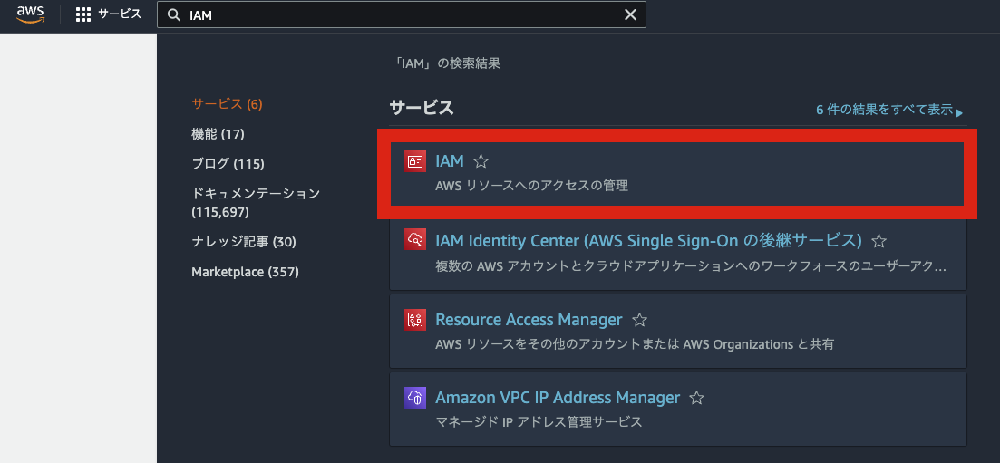
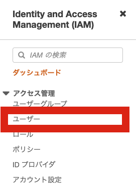
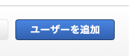
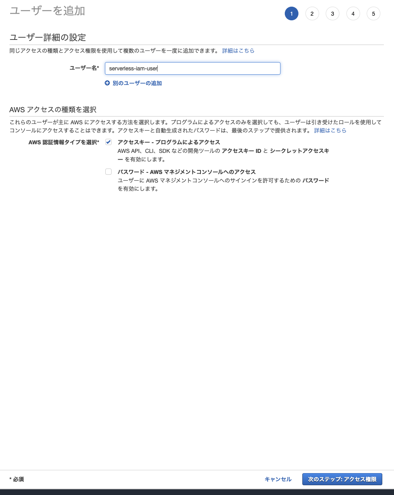
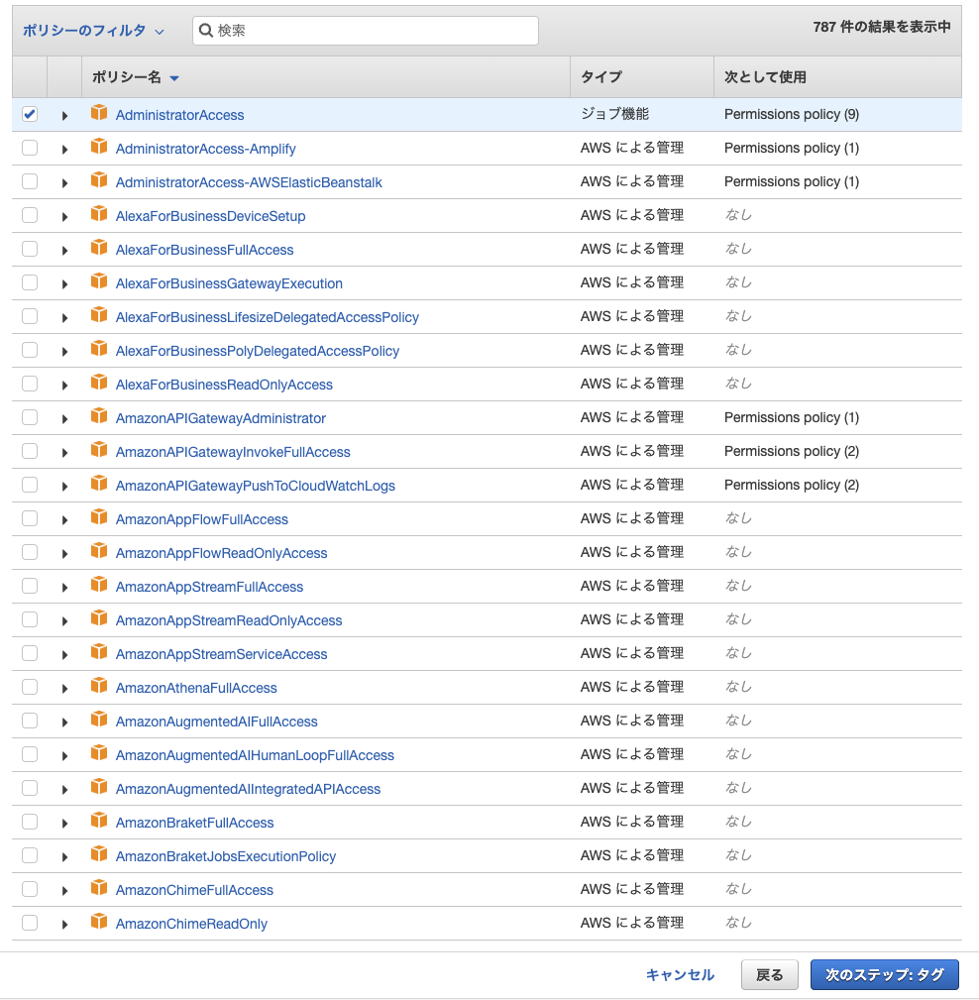
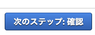
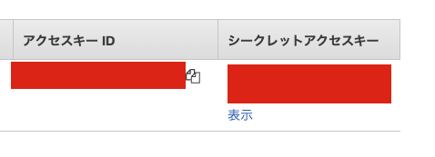

# AWSのCredential作成方法について

ページ数の関係で書籍に記載できなかった、AWSのCredential作成方法について解説します。

1.AWSマネジメントコンソール（<https://ap-northeast-1.console.aws.amazon.com/console/home>）にアクセスします

2.検索バーに「IAM」と入力し、「IAM」を選択します

3.左側のメニューから「ユーザー」を選択します

4.「ユーザーを追加」を選択します

5.ユーザー名を入力して「アクセスキー - プログラムによるアクセス」にチェックをいれ、「次のステップ: アクセス権限」をクリックします

6.「既存のポリシーを直接アタッチ」を選択します

7.「AdministratorAccess」を選択して、「次のステップ: タグ」をクリックします

8.「次のステップ: 確認」を選択します

9.「ユーザーの作成」を選択します

10.アクセスキーIDとシークレットアクセスキーが表示されるので、どこかにメモしておきます

11.<https://docs.aws.amazon.com/ja_jp/cli/latest/userguide/getting-started-install.html>
html を参考にaws-cli を導入します

12.ローカルで`aws configure`コマンドを実行し、先ほどメモしたCredential情報を入力します
